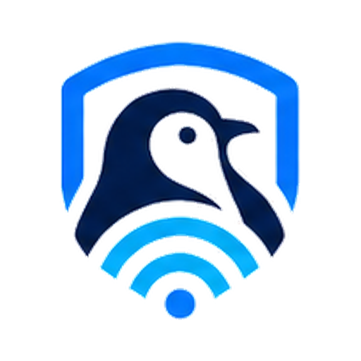

<p align="center">
  
</p>

# pingwin

**pingwin** is an open-source Android client for VLESS connections, powered by [sing-box](https://github.com/SagerNet/sing-box).

[](https://github.com/scripchenko/pingwin/releases/latest)

[](LICENSE)

## [Download latest APK](https://github.com/scripchenko/pingwin/releases/latest)

Open the latest release, expand **Assets**, and download the file named `pingwin-<version>.apk`. The automatically generated source code archives are not Android installation packages.

> [!IMPORTANT]
> pingwin is a client application. It does not provide VPN servers, subscriptions, or connection credentials.
>
> You need your own compatible VLESS configuration. Current builds support VLESS over TCP with REALITY.

## Overview

pingwin manages compatible VLESS connections and runs them through Android's VPN service using sing-box/libbox.

The application provides connection management, separate routing rules for applications and domains, network-based automation, MacroDroid actions, and diagnostic logs. The interface is available in English and Russian.

## Features

### Connections

- Save and switch between multiple VLESS connections
- Add a connection by entering or pasting a VLESS link
- Import a VLESS link from the clipboard
- Scan a VLESS QR code with the device camera
- Current protocol support: VLESS over TCP with REALITY

### Routing

- Application routing based on installed Android packages
- Send only selected applications through the VLESS connection
- Exclude selected applications from the VLESS connection
- Website and domain-based routing rules
- Send only selected domains through the VLESS connection
- Exclude selected domains from the VLESS connection

Routing changes are applied after reconnecting the VPN.

### Automation

- Connect automatically when using mobile data
- Connect automatically on Wi-Fi networks that are not in the trusted list
- Disconnect automatically on trusted Wi-Fi networks
- Restore enabled automation after a device restart or application update
- MacroDroid actions for connecting, disconnecting, and toggling the VPN

### Diagnostics and interface

- Connection event log
- Optional detailed sing-box logging
- Copy, share, and clear diagnostic logs
- English and Russian interface

## Requirements

- Android 7.0 or newer (`minSdk 24`)
- Your own VLESS server or configuration
- A VLESS link using TCP transport and REALITY security
- The VLESS link must contain the required server, UUID, REALITY public key (`pbk`), and server name (`sni`) values

Android will ask for permission to create a VPN connection when pingwin connects for the first time.

## Installation

1. Open the [latest release](https://github.com/scripchenko/pingwin/releases/latest).
2. Expand the **Assets** section.
3. Download `pingwin-<version>.apk`.
4. Open the downloaded APK.
5. If Android asks for permission, allow your browser or file manager to install applications from that source.
6. Start pingwin and add your VLESS configuration.

## Getting started

1. Obtain a compatible VLESS link from your server administrator or service provider.
2. Open pingwin.
3. Add the connection using one of these methods:
   - paste the link manually;
   - import it from the clipboard;
   - scan a QR code.
4. Select the saved connection.
5. Tap the connection control on the home screen.
6. Approve Android's VPN connection request when prompted.

Additional connections can be saved and selected from the **Connections** screen.

Routing and automation are optional. Configure them from **Settings** after confirming that the connection works normally.

## Permissions and privacy

The following behavior is confirmed by the current source code:

- **VPN access:** Android VPN permission is required to create the local VPN interface and route traffic through sing-box.
- **Camera:** Camera access is used when the QR code scanner is opened. It is not required for manual or clipboard import.
- **Location:** Android protects access to the current Wi-Fi network name (SSID) with location permissions. Background location access is required for Wi-Fi automation to identify trusted and untrusted networks while pingwin is not in the foreground.
- **Notifications:** The VPN connection and network automation run as Android foreground services. Their notifications show service status while those services are active.
- **Stored data:** Saved VLESS links, routing rules, automation settings, cached server location information, and diagnostic logs are stored in regular app-private Android preferences. These preferences are not additionally encrypted by pingwin. VLESS links contain connection credentials.
- **Android backup:** Android backup is enabled in the application manifest. Actual backup behavior depends on the Android version, device, and backup settings.
- **Server location lookup:** To display a country flag, pingwin may send the configured server host name or IP address to [`ipwho.is`](https://ipwho.is/) when no cached result is available. The returned country information is cached in the application preferences.
- **Diagnostic logs:** Shared logs can include the pingwin version, Android version, device manufacturer and model, and recorded events. Review logs and remove sensitive information before copying, sharing, or attaching them to an issue.

If the Wi-Fi SSID cannot be determined, the corresponding Wi-Fi automation rule is not applied.

## Building from source

### Prerequisites

- Git
- Git LFS
- JDK 17 or newer
- Android SDK Platform 37

The tracked `app/libs/libbox.aar` file is stored through Git LFS.

Clone the repository and download the Git LFS objects:

```bash
git clone https://github.com/scripchenko/pingwin.git
cd pingwin
git lfs pull
```

Build a debug APK on Linux or macOS:

```bash
./gradlew assembleDebug
```

Build a debug APK on Windows:

```powershell
.\gradlew.bat assembleDebug
```

The generated APK is located at:

```text
app/build/outputs/apk/debug/app-debug.apk
```

Run local unit tests on Linux or macOS:

```bash
./gradlew testDebugUnitTest
```

Run local unit tests on Windows:

```powershell
.\gradlew.bat testDebugUnitTest
```

## Releases and APK verification

Official APK files are published in [GitHub Releases](https://github.com/scripchenko/pingwin/releases).

Each release provides a SHA-256 checksum. After downloading the APK, calculate its checksum and compare it with the value published for that release.

Windows PowerShell:

```powershell
Get-FileHash .\pingwin-*.apk -Algorithm SHA256
```

Linux:

```bash
sha256sum pingwin-*.apk
```

macOS:

```bash
shasum -a 256 pingwin-*.apk
```

Do not install the file if the calculated checksum does not match the published checksum.

## Support and issues

Use [GitHub Issues](https://github.com/scripchenko/pingwin/issues) to report a problem.

When creating an issue, include:

- pingwin version;
- Android version and device model;
- steps needed to reproduce the problem;
- the expected and actual behavior;
- relevant diagnostic log entries, with sensitive information removed.

Do not publish complete VLESS links, UUIDs, QR codes, credentials, or private server information in an issue.

## License

pingwin is free and open-source software licensed under the GNU General Public License v3.0 or later (`GPL-3.0-or-later`).

See [LICENSE](LICENSE) for the full license text.

## Acknowledgements

pingwin uses [sing-box](https://github.com/SagerNet/sing-box) and its Android libbox bindings for the VPN core.

QR code scanning is provided by [ZXing Android Embedded](https://github.com/journeyapps/zxing-android-embedded).
